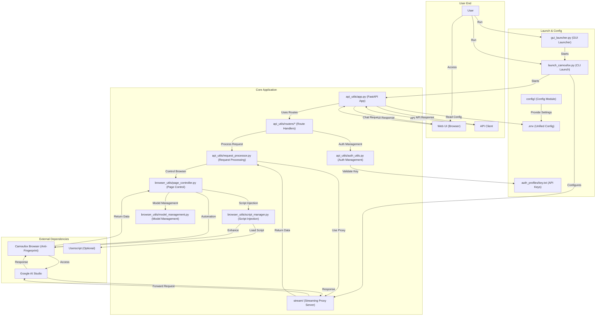

# AI Studio Proxy API

A Python-based proxy server that converts Google AI Studio's web interface into an OpenAI-compatible API. Utilizes Camoufox (anti-fingerprinting Firefox) and Playwright automation to provide stable API access.

[](https://www.star-history.com/#CJackHwang/AIstudioProxyAPI&Date)

This project is generously sponsored by ZMTO. Visit their website: [https://zmto.com/](https://zmto.com/)

---

## Acknowledgements

The birth and development of this project would not have been possible without the generous support and wisdom contributions of the following individuals, organizations, and communities:

- **Project Initiation & Main Development**: @CJackHwang ([https://github.com/CJackHwang](https://github.com/CJackHwang))
- **Feature Enhancement & Page Operation Optimization**: @ayuayue ([https://github.com/ayuayue](https://github.com/ayuayue))
- **Real-time Streaming Feature Optimization & Enhancement**: @luispater ([https://github.com/luispater](https://github.com/luispater))
- **Great Contribution to 3400+ Line Main File Project Refactoring**: @yattin (Holt) ([https://github.com/yattin](https://github.com/yattin))
- **High-quality Maintenance in Later Project Stages**: @Louie ([https://github.com/NikkeTryHard](https://github.com/NikkeTryHard))
- **Community Support & Inspiration**: Special thanks to the [Linux.do community](https://linux.do/) members for their enthusiastic discussions, valuable suggestions, and problem feedback. Your participation is an important driving force for the project's progress.

We also sincerely thank every friend who has silently contributed to this project through submitting Issues, providing suggestions, sharing user experiences, and contributing code fixes. It is your collective efforts that make this project better!

---

**This is the currently maintained Python version. For the no longer maintained JavaScript version, see [`deprecated_javascript_version/README.md`](deprecated_javascript_version/README.md).**

## System Requirements

- **Python**: >=3.9, <4.0 (3.10+ recommended for best performance, Docker environment uses 3.10)
- **Dependency Management**: [Poetry](https://python-poetry.org/) (Modern Python dependency management tool, replacing traditional requirements.txt)
- **Type Checking**: [Pyright](https://github.com/microsoft/pyright) (Optional, for development-time type checking and IDE support)
- **Operating Systems**: Windows, macOS, Linux (Full cross-platform support, Docker deployment supports x86_64 and ARM64)
- **Memory**: Recommended 2GB+ available memory (Browser automation requires it)
- **Network**: Stable internet connection to access Google AI Studio (Proxy configuration supported)

## Key Features

- **OpenAI Compatible API**: Supports `/v1/chat/completions` endpoint, fully compatible with OpenAI clients and third-party tools
- **Three-Tier Streaming Response Mechanism**: Integrated streaming proxy → External Helper service → Playwright page interaction for multiple guarantees
- **Smart Model Switching**: Dynamically switch between models in AI Studio through the `model` field in API requests
- **Complete Parameter Control**: Supports all major parameters including `temperature`, `max_output_tokens`, `top_p`, `stop`, `reasoning_effort`, etc.
- **Anti-Fingerprinting**: Uses Camoufox browser to reduce risk of being detected as automation scripts
- **Script Injection Feature v3.0**: Uses Playwright native network interception, supports userscript dynamic mounting, 100% reliable 🆕
- **Modern Web UI**: Built-in testing interface with real-time chat, status monitoring, and tiered API key management
- **GUI Launcher**: Feature-rich GUI launcher to simplify configuration and process management
- **Flexible Authentication System**: Supports optional API key authentication, fully compatible with OpenAI standard Bearer token format
- **Modular Architecture**: Clear modular separation design with independent modules like api_utils/, browser_utils/, config/, etc.
- **Unified Configuration Management**: Based on `.env` file unified configuration, supports environment variable overrides, Docker compatible
- **Modern Development Tools**: Poetry dependency management + Pyright type checking for excellent development experience

## System Architecture



## Configuration Management ⭐

**New Feature**: The project now supports configuration management through `.env` files, avoiding hardcoded parameters!

### Quick Configuration

```bash
# 1. Copy configuration template
cp .env.example .env

# 2. Edit configuration file
nano .env  # Or use other editor

# 3. Start service (automatically reads configuration)
python gui_launcher.py
# Or direct CLI launch
python launch_camoufox.py --headless
```

### Main Advantages

- ✅ **Worry-free Version Updates**: Complete updates with just a `git pull`, no reconfiguration needed
- ✅ **Centralized Configuration**: All configuration items unified in `.env` file
- ✅ **Simplified Launch Commands**: No complex command-line parameters, one-click startup
- ✅ **Security**: `.env` file is ignored by `.gitignore`, won't leak configuration
- ✅ **Flexibility**: Supports configuration management for different environments
- ✅ **Docker Compatible**: Docker and local environments use the same configuration method

For detailed configuration instructions, see [Environment Variable Configuration Guide](docs/environment-configuration.md).

## Usage Tutorial

Recommended to use [`gui_launcher.py`](gui_launcher.py) (GUI) or directly use [`launch_camoufox.py`](launch_camoufox.py) (CLI) for daily operations. Only use debug mode for initial setup or when authentication expires.

### Quick Start

This project uses a modern Python development toolchain with [Poetry](https://python-poetry.org/) for dependency management and [Pyright](https://github.com/microsoft/pyright) for type checking.

#### 🚀 One-Click Installation Script (Recommended)

```bash
# macOS/Linux users
curl -sSL https://raw.githubusercontent.com/CJackHwang/AIstudioProxyAPI/main/scripts/install.sh | bash

# Windows users (PowerShell)
iwr -useb https://raw.githubusercontent.com/CJackHwang/AIstudioProxyAPI/main/scripts/install.ps1 | iex
```

#### 📋 Manual Installation Steps

1. **Install Poetry** (if not already installed):

    ```bash
    # macOS/Linux
    curl -sSL https://install.python-poetry.org | python3 -

    # Windows (PowerShell)
    (Invoke-WebRequest -Uri https://install.python-poetry.org -UseBasicParsing).Content | py -

    # Or use package managers
    # macOS: brew install poetry
    # Ubuntu/Debian: apt install python3-poetry
    ```

2. **Clone Project**:

    ```bash
    git clone https://github.com/JackHwang/AIstudioProxyAPI.git
    cd AIstudioProxyAPI
    ```

3. **Install Dependencies**:
    Poetry automatically creates virtual environment and installs all dependencies:

    ```bash
    poetry install
    ```

4. **Activate Virtual Environment**:

    ```bash
    # Method 1: Activate shell (recommended for daily development)
    poetry env activate

    # Method 2: Run commands directly (recommended for automation scripts)
    poetry run python gui_launcher.py
    ```

#### 🔧 Follow-up Configuration Steps

5. **Environment Configuration**: See [Environment Variable Configuration Guide](docs/environment-configuration.md) - **Recommended to configure first**
6. **First Authentication**: See [Authentication Setup Guide](docs/authentication-setup.md)
7. **Daily Operation**: See [Daily Usage Guide](docs/daily-usage.md)
8. **API Usage**: See [API Usage Guide](docs/api-usage.md)
9. **Web Interface**: See [Web UI Usage Guide](docs/webui-guide.md)

#### 🛠️ Developer Options

If you are a developer, you can also:

```bash
# Install development dependencies (includes type checking, testing tools, etc.)
poetry install --with dev

# Enable type checking (need to install pyright)
npm install -g pyright
pyright

# View project dependency tree
poetry show --tree

# Update dependencies
poetry update
```

### 📚 Detailed Documentation

#### 🚀 Quick Start

- [Installation Guide](docs/installation-guide.md) - Detailed installation steps and environment configuration
- [Environment Variable Configuration Guide](docs/environment-configuration.md) - **.env file configuration management** ⭐
- [Authentication Setup Guide](docs/authentication-setup.md) - First run and authentication file setup
- [Daily Usage Guide](docs/daily-usage.md) - Daily use and configuration options

#### 🔧 Feature Usage

- [API Usage Guide](docs/api-usage.md) - API endpoints and client configuration
- [Web UI Usage Guide](docs/webui-guide.md) - Web interface feature description
- [Script Injection Guide](docs/script_injection_guide.md) - Userscript dynamic mounting feature usage guide (v3.0) 🆕

#### ⚙️ Advanced Configuration

- [Streaming Processing Modes Detailed](docs/streaming-modes.md) - Three-tier response acquisition mechanism detailed explanation 🆕
- [Advanced Configuration Guide](docs/advanced-configuration.md) - Advanced features and configuration options
- [Logging Control Guide](docs/logging-control.md) - Logging system configuration and debugging
- [Troubleshooting Guide](docs/troubleshooting.md) - Common problem solutions

#### 🛠️ Development Related

- [Project Architecture Guide](docs/architecture-guide.md) - Modular architecture design and component details 🆕
- [Developer Guide](docs/development-guide.md) - Poetry, Pyright and development workflow
- [Dependency Version Description](docs/dependency-versions.md) - Poetry dependency management and version control details

## Client Configuration Example

Using Open WebUI as an example:

1. Open Open WebUI
2. Go to "Settings" -> "Connections"
3. In the "Models" section, click "Add Model"
4. **Model Name**: Enter your desired name, e.g., `aistudio-gemini-py`
5. **API Base URL**: Enter `http://127.0.0.1:2048/v1`
6. **API Key**: Leave blank or enter any character
7. Save settings and start chatting

---

## External Control Endpoints (New chat / Click Run / Click Stop / Scroll)

These auxiliary endpoints allow triggering UI operations on the AI Studio page from external sources (create new session, click Run, click Stop). Only available when the browser and page have been successfully initialized.

- Authentication: API Key middleware only protects endpoints starting with `/v1/`. The `/api/*` endpoints in this document do not require authentication by default. If protection is needed, add authentication in reverse proxy or custom middleware.
- Prerequisites: Service is started, `Playwright` successfully connects to browser, page is not closed; generally need to configure `CAMOUFOX_WS_ENDPOINT` (unless using `direct_debug_no_browser` mode).

### 1) Create New Session (New chat)

- Method: POST
- URL: `http://127.0.0.1:2048/api/new-chat`
- Request body: None
- Success return:

```json
{"success": true, "message": "New chat created successfully."}
```

- Possible errors:
  - `503 Browser page is not available`: Browser page unavailable/not connected
  - `500 Failed to create a new chat`: Click or confirmation process failed

- Example:

PowerShell

```powershell
Invoke-RestMethod -Method Post -Uri "http://127.0.0.1:2048/api/new-chat"
```

curl

```bash
curl -X POST http://127.0.0.1:2048/api/new-chat
```

### 2) Trigger Run Button (Click Run)

- Method: POST
- URL: `http://127.0.0.1:2048/api/click-run`
- Request body (optional):

```json
{"delay_ms": 0}
```

- Description: `delay_ms` is the delay before clicking (milliseconds). If a confirmation overlay exists on the page, it will automatically click confirmation first then try to click Run; if the button is not ready/disabled, it will not click this time.
- Success return:

```json
{"success": true, "message": "Run clicked.", "delay_ms": 0}
```

- Possible errors:
  - `503 Browser page is not available`: Browser page unavailable/not connected
  - `500 Failed to click Run`: Button not visible/not enabled or click failed

- Example:

PowerShell (500ms delay)

```powershell
Invoke-RestMethod -Method Post -Uri "http://127.0.0.1:2048/api/click-run" -ContentType "application/json" -Body '{"delay_ms":500}'
```

curl (500ms delay)

```bash
curl -X POST http://127.0.0.1:2048/api/click-run \
  -H "Content-Type: application/json" \
  -d '{"delay_ms":500}'
```

- Usage suggestion: If you want to "resend/re-execute" after page generation ends, set `delay_ms` to 300–1000ms to avoid instantaneous not-ready states.

### 3) Trigger Stop Button (Click Stop)

- Method: POST
- URL: `http://127.0.0.1:2048/api/click-stop`
- Request body (optional):

```json
{"delay_ms": 0}
```

- Description: Stop and Run use the same toggle button. When called, it will try to wait for a brief loading indicator (spinner) to appear to ensure it's in a stoppable state; if a confirmation overlay exists, it will auto-confirm first; if the button is not ready/disabled, it will not click this time.
- Success return:

```json
{"success": true, "message": "Stop clicked.", "delay_ms": 0}
```

- Possible errors:
  - `503 Browser page is not available`: Browser page unavailable/not connected
  - `500 Failed to click Stop`: Button not visible/not enabled or click failed

- Example:

PowerShell (500ms delay)

```powershell
Invoke-RestMethod -Method Post -Uri "http://127.0.0.1:2048/api/click-stop" -ContentType "application/json" -Body '{"delay_ms":500}'
```

curl (500ms delay)

```bash
curl -X POST http://127.0.0.1:2048/api/click-stop \
  -H "Content-Type: application/json" \
  -d '{"delay_ms":500}'
```

- Usage suggestion: If you need to quickly abort generation when client disconnects or quota is reached, set `delay_ms` to 100–500ms to improve hit probability when in a stoppable state.

### 4) Scroll to Top of Page

- Method: POST
- URL: `http://127.0.0.1:2048/api/scroll-to-top`
- Request body: None
- Success return:

```json
{"success": true, "message": "Scrolled to top of page."}
```

- Possible errors:
  - `503 Browser page is not available`: Browser page unavailable/not connected
  - `500 Failed to scroll to top`: Scroll operation failed

- Example:

PowerShell

```powershell
Invoke-RestMethod -Method Post -Uri "http://127.0.0.1:2048/api/scroll-to-top" -ContentType "application/json"
```

curl

```bash
curl -X POST http://127.0.0.1:2048/api/scroll-to-top \
  -H "Content-Type: application/json"
```

### 5) Scroll to Bottom of Page

- Method: POST
- URL: `http://127.0.0.1:2048/api/scroll-to-bottom`
- Request body: None
- Success return:

```json
{"success": true, "message": "Scrolled to bottom of page."}
```

- Possible errors:
  - `503 Browser page is not available`: Browser page unavailable/not connected
  - `500 Failed to scroll to bottom`: Scroll operation failed

- Example:

PowerShell

```powershell
Invoke-RestMethod -Method Post -Uri "http://127.0.0.1:2048/api/scroll-to-bottom" -ContentType "application/json"
```

curl

```bash
curl -X POST http://127.0.0.1:2048/api/scroll-to-bottom \
  -H "Content-Type: application/json"
```

---

## 🐳 Docker Deployment

This project supports deployment through Docker, using **Poetry** for dependency management, **fully supports `.env` configuration files**!

> 📁 **Note**: All Docker-related files have been moved to `docker/` directory to keep the project root directory clean.

### 🚀 Quick Docker Deployment

```bash
# 1. Prepare configuration files
cd docker
cp .env.docker .env
nano .env  # Edit configuration

# 2. Start using Docker Compose
docker compose up -d

# 3. View logs
docker compose logs -f

# 4. Version update (in docker directory)
bash update.sh
```

### 📚 Detailed Documentation

- [Docker Deployment Guide (docker/README-Docker.md)](docker/README-Docker.md) - Contains complete Poetry + `.env` configuration instructions
- [Docker Quick Guide (docker/README.md)](docker/README.md) - Quick start guide

### ✨ Docker Features

- ✅ **Poetry Dependency Management**: Use modern Python dependency management tools
- ✅ **Multi-stage Build**: Optimize image size and build speed
- ✅ **Unified Configuration**: Use `.env` file to manage all configurations
- ✅ **Version Updates**: Complete updates with `bash update.sh`
- ✅ **Clean Directory**: Docker files moved to `docker/` directory
- ✅ **Cross-platform Support**: Support x86_64 and ARM64 architectures
- ⚠️ **Authentication Files**: First run needs to obtain authentication files on host, then mount to container

---

## About Camoufox

This project uses [Camoufox](https://camoufox.com/) to provide browser instances with enhanced anti-fingerprinting capabilities.

- **Core Goal**: Simulate real user traffic, avoid being identified as automation scripts or robots by websites
- **Implementation**: Camoufox is based on Firefox, disguises device fingerprints (such as screen, operating system, WebGL, fonts, etc.) by modifying browser's underlying C++ implementation, rather than through easily detectable JavaScript injection
- **Playwright Compatible**: Camoufox provides an interface compatible with Playwright
- **Python Interface**: Camoufox provides a Python package that can start its service through `camoufox.server.launch_server()` and control it through WebSocket connections

The main purpose of using Camoufox is to improve stealth when interacting with AI Studio web pages, reducing the possibility of being detected or restricted. But please note that no anti-fingerprinting technology is absolutely perfect.

## Important Notes

### Three-Tier Response Acquisition Mechanism and Parameter Control

- **Response Acquisition Priority**: The project adopts a three-tier response acquisition mechanism to ensure high availability:

  1. **Integrated Streaming Proxy Service**: Enabled by default, port 3120, provides best performance and stability
  2. **External Helper Service**: Optional configuration, requires valid authentication file, as backup
  3. **Playwright Page Interaction**: Final fallback, obtains responses through browser automation

- **Parameter Control Mechanism**:

  - **Streaming Proxy Mode**: Supports basic parameter passing, optimal performance
  - **Helper Service Mode**: Parameter support depends on external service implementation
  - **Playwright Mode**: Full support for all parameters (`temperature`, `max_output_tokens`, `top_p`, `stop`, `reasoning_effort`, etc.)

- **Script Injection Enhancement**: v3.0 version uses Playwright native network interception, ensuring injected models are 100% consistent with native models

### Client History Management

**Client manages history, proxy doesn't support UI editing**: The client is responsible for maintaining complete chat history and sending it to the proxy. The proxy server itself does not support editing or forking historical messages in the AI Studio interface.

## Future Plans

Here are some planned improvement directions:

- **Cloud Server Deployment Guide**: Provide more detailed guides for deploying and managing services on mainstream cloud platforms
- **Authentication Update Process Optimization**: Explore more convenient authentication file update mechanisms, reduce manual operations
- **Process Robustness Optimization**: Reduce error rates and approach native experience

## Contributing

Issues and Pull Requests are welcome!

## License

[AGPLv3](LICENSE)

## Development is not easy, support the author

If you find this project helpful to you and wish to support the author's continued development, you are welcome to donate through the following methods. Your support is our greatest encouragement!

