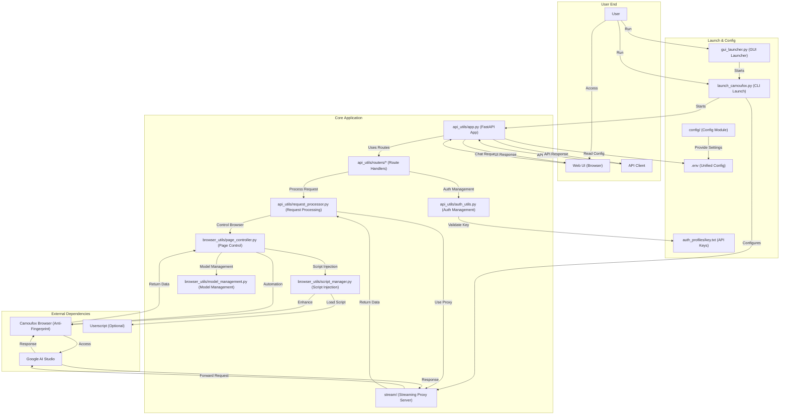

# AI Studio Proxy API

A Python-based proxy server that converts Google AI Studio's web interface into an OpenAI-compatible API. Utilizes Camoufox (anti-fingerprinting Firefox) and Playwright automation to provide stable API access.

[](https://www.star-history.com/#CJackHwang/AIstudioProxyAPI&Date)

This project is generously sponsored by ZMTO. Visit their website: [https://zmto.com/](https://zmto.com/)

---

## Acknowledgements

The birth and development of this project would not have been possible without the generous support and wisdom contributions of the following individuals, organizations, and communities:

- **Project Initiation & Main Development**: @CJackHwang ([https://github.com/CJackHwang](https://github.com/CJackHwang))
- **Feature Enhancement & Page Operation Optimization**: @ayuayue ([https://github.com/ayuayue](https://github.com/ayuayue))
- **Real-time Streaming Feature Optimization & Enhancement**: @luispater ([https://github.com/luispater](https://github.com/luispater))
- **Great Contribution to 3400+ Line Main File Project Refactoring**: @yattin (Holt) ([https://github.com/yattin](https://github.com/yattin))
- **High-quality Maintenance in Later Project Stages**: @Louie ([https://github.com/NikkeTryHard](https://github.com/NikkeTryHard))
- **Community Support & Inspiration**: Special thanks to the [Linux.do community](https://linux.do/) members for their enthusiastic discussions, valuable suggestions, and problem feedback. Your participation is an important driving force for the project's progress.

We also sincerely thank every friend who has silently contributed to this project through submitting Issues, providing suggestions, sharing user experiences, and contributing code fixes. It is your collective efforts that make this project better!

---

**This is the currently maintained Python version. For the no longer maintained JavaScript version, see [`deprecated_javascript_version/README.md`](deprecated_javascript_version/README.md).**

## System Requirements

- **Python**: >=3.9, <4.0 (3.10+ recommended for best performance, Docker environment uses 3.10)
- **Dependency Management**: [Poetry](https://python-poetry.org/) (Modern Python dependency management tool, replacing traditional requirements.txt)
- **Type Checking**: [Pyright](https://github.com/microsoft/pyright) (Optional, for development-time type checking and IDE support)
- **Operating Systems**: Windows, macOS, Linux (Full cross-platform support, Docker deployment supports x86_64 and ARM64)
- **Memory**: Recommended 2GB+ available memory (Browser automation requires it)
- **Network**: Stable internet connection to access Google AI Studio (Proxy configuration supported)

## Key Features

- **OpenAI Compatible API**: Supports `/v1/chat/completions` endpoint, fully compatible with OpenAI clients and third-party tools
- **Three-Tier Streaming Response Mechanism**: Integrated streaming proxy → External Helper service → Playwright page interaction for multiple guarantees
- **Smart Model Switching**: Dynamically switch between models in AI Studio through the `model` field in API requests
- **Complete Parameter Control**: Supports all major parameters including `temperature`, `max_output_tokens`, `top_p`, `stop`, `reasoning_effort`, etc.
- **Anti-Fingerprinting**: Uses Camoufox browser to reduce risk of being detected as automation scripts
- **Script Injection Feature v3.0**: Uses Playwright native network interception, supports userscript dynamic mounting, 100% reliable 🆕
- **Modern Web UI**: Built-in testing interface with real-time chat, status monitoring, and tiered API key management
- **GUI Launcher**: Feature-rich GUI launcher to simplify configuration and process management
- **Flexible Authentication System**: Supports optional API key authentication, fully compatible with OpenAI standard Bearer token format
- **Modular Architecture**: Clear modular separation design with independent modules like api_utils/, browser_utils/, config/, etc.
- **Unified Configuration Management**: Based on `.env` file unified configuration, supports environment variable overrides, Docker compatible
- **Modern Development Tools**: Poetry dependency management + Pyright type checking for excellent development experience

**这是当前维护的 Python 版本。不再维护的 Javascript 版本请参见 [`deprecated_javascript_version/README.md`](deprecated_javascript_version/README.md)。**

## 📊 兼容性矩阵

| 组件 | 版本要求 | 推荐版本 | 说明 |
|------|---------|---------|------|
| **Python** | ≥3.9, <4.0 | 3.10+ 或 3.11+ | Docker 环境使用 3.10 |
| **操作系统** | Windows / macOS / Linux | - | 完全跨平台支持，Docker 支持 x86_64 和 ARM64 |
| **内存** | ≥2GB | ≥4GB | 浏览器自动化需要 |
| **网络** | 稳定互联网连接 | - | 可配置代理访问 Google AI Studio |
| **依赖管理** | Poetry | 最新版本 | 现代化 Python 依赖管理工具 |
| **类型检查** | Pyright (可选) | 最新版本 | 用于开发时类型检查和 IDE 支持 |


## 系统要求

- **Python**: >=3.9, <4.0 (推荐 3.10+ 以获得最佳性能，Docker 环境使用 3.10)
- **依赖管理**: [Poetry](https://python-poetry.org/) (现代化 Python 依赖管理工具，替代传统 requirements.txt)
- **类型检查**: [Pyright](https://github.com/microsoft/pyright) (可选，用于开发时类型检查和 IDE 支持)
- **操作系统**: Windows, macOS, Linux (完全跨平台支持，Docker 部署支持 x86_64 和 ARM64)
- **内存**: 建议 2GB+ 可用内存 (浏览器自动化需要)
- **网络**: 稳定的互联网连接访问 Google AI Studio (支持代理配置)

## 主要特性

- **OpenAI 兼容 API**: 支持 `/v1/chat/completions` 端点，完全兼容 OpenAI 客户端和第三方工具
- **三层流式响应机制**: 集成流式代理 → 外部 Helper 服务 → Playwright 页面交互的多重保障
- **智能模型切换**: 通过 API 请求中的 `model` 字段动态切换 AI Studio 中的模型
- **完整参数控制**: 支持 `temperature`、`max_output_tokens`、`top_p`、`stop`、`reasoning_effort` 等所有主要参数
- **反指纹检测**: 使用 Camoufox 浏览器降低被检测为自动化脚本的风险
- **脚本注入功能 v3.0**: 使用 Playwright 原生网络拦截，支持油猴脚本动态挂载，100%可靠 🆕
- **现代化 Web UI**: 内置测试界面，支持实时聊天、状态监控、分级 API 密钥管理
- **图形界面启动器**: 提供功能丰富的 GUI 启动器，简化配置和进程管理
- **灵活认证系统**: 支持可选的 API 密钥认证，完全兼容 OpenAI 标准的 Bearer token 格式
- **模块化架构**: 清晰的模块分离设计，api_utils/、browser_utils/、config/ 等独立模块
- **统一配置管理**: 基于 `.env` 文件的统一配置方式，支持环境变量覆盖，Docker 兼容
- **现代化开发工具**: Poetry 依赖管理 + Pyright 类型检查，提供优秀的开发体验

## 系统架构



## 🚀 快速开始

推荐新用户按照 **[快速开始指南](docs/quick-start-guide.md)** 进行部署，预计 15-30 分钟即可完成。

### 三步快速部署

```bash
# 1️⃣ 克隆并安装
git clone https://github.com/CJackHwang/AIstudioProxyAPI.git
cd AIstudioProxyAPI
poetry install  # 自动创建虚拟环境并安装依赖

# 2️⃣ 配置环境
cp .env.example .env
nano .env  # 编辑配置（可选，默认配置即可使用）

# 3️⃣ 首次认证并启动
poetry run python launch_camoufox.py --debug  # 首次认证（需要登录 Google）
# 认证成功后，按 Ctrl+C 停止，然后使用无头模式运行：
poetry run python launch_camoufox.py --headless
```

### 快速测试

```bash
# 健康检查
curl http://127.0.0.1:2048/health

# 获取模型列表
curl http://127.0.0.1:2048/v1/models

# 测试聊天（非流式）
curl -X POST http://127.0.0.1:2048/v1/chat/completions \
  -H "Content-Type: application/json" \
  -d '{"model":"gemini-2.5-pro","messages":[{"role":"user","content":"Hello"}]}'

# 测试流式聊天
curl -X POST http://127.0.0.1:2048/v1/chat/completions \
  -H "Content-Type: application/json" \
  -d '{"model":"gemini-2.5-pro","messages":[{"role":"user","content":"讲个故事"}],"stream":true}' --no-buffer
```

### 访问 Web UI

打开浏览器访问 `http://127.0.0.1:2048/` 使用内置的 Web 聊天界面。

---

## 📦 安装与依赖管理

### 前置要求

- Python 3.9+ (推荐 3.10 或 3.11)
- 2GB+ 可用内存
- 稳定的互联网连接

### 一键安装脚本

**macOS/Linux**:
```bash
curl -sSL https://raw.githubusercontent.com/CJackHwang/AIstudioProxyAPI/main/scripts/install.sh | bash
```

**Windows (PowerShell)**:
```powershell
iwr -useb https://raw.githubusercontent.com/CJackHwang/AIstudioProxyAPI/main/scripts/install.ps1 | iex
```

### 手动安装步骤

#### 1. 安装 Poetry

```bash
# macOS/Linux
curl -sSL https://install.python-poetry.org | python3 -

# Windows (PowerShell)
(Invoke-WebRequest -Uri https://install.python-poetry.org -UseBasicParsing).Content | py -
```

#### 2. 克隆项目

```bash
git clone https://github.com/CJackHwang/AIstudioProxyAPI.git
cd AIstudioProxyAPI
```

#### 3. 安装依赖

```bash
poetry install
```

#### 4. 安装浏览器和 Camoufox

```bash
# 激活 Poetry 环境
poetry shell

# 安装 Playwright 浏览器
playwright install firefox

# 下载 Camoufox 数据文件
camoufox fetch
# 或使用备用方法
python fetch_camoufox_data.py
```

### 使用 uv 或 pip (可选)

```bash
# 导出 requirements.txt
poetry export -f requirements.txt --output requirements.txt --without-hashes

# 使用 uv (更快)
pip install uv
uv pip install -r requirements.txt

# 使用 pip (传统方式)
pip install -r requirements.txt
```

---

## 🎮 运行与调试

### 日常运行模式

| 命令 | 说明 | 适用场景 |
|------|------|---------|
| `python gui_launcher.py` | GUI 启动器 | 新手、可视化配置 |
| `python launch_camoufox.py --headless` | 无头模式 | 日常使用、服务器 |
| `python launch_camoufox.py` | 普通模式 | 查看浏览器窗口 |
| `python launch_camoufox.py --debug` | 调试模式 | 首次认证、故障排查 |
| `python launch_camoufox.py --virtual-display` | 虚拟显示模式 | Linux 无 GUI 环境 |

### 直接启动 FastAPI (开发调试)

```bash
# 需要先手动配置 CAMOUFOX_WS_ENDPOINT 环境变量
export CAMOUFOX_WS_ENDPOINT=ws://127.0.0.1:9222
uvicorn server:app --host 0.0.0.0 --port 2048
```

### 查看日志

```bash
# 实时日志
tail -f logs/app.log

# 错误日志
grep -i error logs/app.log

# 启动日志
tail -f logs/launch_app.log
```

### 常用命令行参数

```bash
python launch_camoufox.py --help

常用选项：
  --headless              无头模式运行
  --debug                 调试模式（显示浏览器窗口）
  --virtual-display       使用虚拟显示（Linux 无 GUI）
  --server-port PORT      FastAPI 端口（默认 2048）
  --stream-port PORT      流式代理端口（默认 3120）
  --internal-camoufox-proxy URL  浏览器代理地址
```

---

## ⚙️ 配置管理

项目采用 `.env` 文件进行配置管理，所有配置项集中管理，无需复杂的命令行参数。

### 快速配置

```bash
# 1. 复制配置模板
cp .env.example .env

# 2. 编辑配置文件
nano .env  # 或使用其他编辑器
```

### 主要配置类别

| 类别 | 示例配置 | 说明 |
|------|---------|------|
| **端口配置** | `PORT=2048` | FastAPI 服务端口 |
| | `STREAM_PORT=3120` | 流式代理端口（设为 0 禁用） |
| **代理配置** | `UNIFIED_PROXY_CONFIG=http://127.0.0.1:7890` | HTTP/HTTPS 代理 |
| **日志配置** | `SERVER_LOG_LEVEL=INFO` | 日志级别 (DEBUG/INFO/WARNING) |
| | `DEBUG_LOGS_ENABLED=false` | 启用调试日志 |
| **API 参数** | `DEFAULT_TEMPERATURE=1.0` | 默认温度参数 |
| | `DEFAULT_MAX_OUTPUT_TOKENS=65536` | 默认最大输出 token |
| **超时配置** | `RESPONSE_COMPLETION_TIMEOUT=300000` | 响应超时（毫秒） |
| **认证配置** | `AUTO_SAVE_AUTH=false` | 自动保存认证文件 |

### 配置优势

- ✅ **版本更新无忧**: `git pull` 后配置保留，无需重新设置
- ✅ **启动命令简化**: 一行命令启动，无需长串参数
- ✅ **安全性**: `.env` 已被 `.gitignore` 忽略，不会泄露敏感信息
- ✅ **Docker 兼容**: Docker 和本地使用相同的配置方式

### 配置文档

- **[环境变量配置指南](docs/environment-configuration.md)** - 配置管理和使用方法 ⭐
- **[环境变量完整参考](docs/env-variables-reference.md)** - 所有配置项的详细说明 📋

---

## 📚 详细文档

#### 🚀 快速开始

- **[快速开始指南](docs/quick-start-guide.md)** - 15分钟快速部署和测试 🎯
- [安装指南](docs/installation-guide.md) - 详细的安装步骤和环境配置
- [环境变量配置指南](docs/environment-configuration.md) - .env 文件配置管理 ⭐
- [环境变量完整参考](docs/env-variables-reference.md) - 所有配置项的详细说明 📋
- [认证设置指南](docs/authentication-setup.md) - 首次运行与认证文件设置
- [日常运行指南](docs/daily-usage.md) - 日常使用和配置选项

#### 🔧 功能使用

- [API 使用指南](docs/api-usage.md) - API 端点和客户端配置
- **[OpenAI 兼容性说明](docs/openai-compatibility.md)** - 与 OpenAI API 的差异和限制 🔄
- **[客户端集成示例](docs/client-examples.md)** - Python、JavaScript、cURL 等示例代码 💻
- [Web UI 使用指南](docs/webui-guide.md) - Web 界面功能说明
- [脚本注入指南](docs/script_injection_guide.md) - 油猴脚本动态挂载功能使用指南 (v3.0) 🆕

#### ⚙️ Advanced Configuration

- [Streaming Processing Modes Detailed](docs/streaming-modes.md) - Three-tier response acquisition mechanism detailed explanation 🆕
- [Advanced Configuration Guide](docs/advanced-configuration.md) - Advanced features and configuration options
- [Logging Control Guide](docs/logging-control.md) - Logging system configuration and debugging
- [Troubleshooting Guide](docs/troubleshooting.md) - Common problem solutions

#### 🌍 平台与部署

- [平台差异说明](docs/platform-differences.md) - Windows/macOS/Linux 差异与注意事项
- [Docker 部署指南 (docker/README-Docker.md)](docker/README-Docker.md) - 完整容器化部署流程
- [Docker 快速指南 (docker/README.md)](docker/README.md) - 一键 Compose 启动

#### 🛠️ 开发相关

- [Project Architecture Guide](docs/architecture-guide.md) - Modular architecture design and component details 🆕
- [Developer Guide](docs/development-guide.md) - Poetry, Pyright and development workflow
- [Dependency Version Description](docs/dependency-versions.md) - Poetry dependency management and version control details

## Client Configuration Example

Using Open WebUI as an example:

1. Open Open WebUI
2. Go to "Settings" -> "Connections"
3. In the "Models" section, click "Add Model"
4. **Model Name**: Enter your desired name, e.g., `aistudio-gemini-py`
5. **API Base URL**: Enter `http://127.0.0.1:2048/v1`
6. **API Key**: Leave blank or enter any character
7. Save settings and start chatting

---

## External Control Endpoints (New chat / Click Run / Click Stop / Scroll)

These auxiliary endpoints allow triggering UI operations on the AI Studio page from external sources (create new session, click Run, click Stop). Only available when the browser and page have been successfully initialized.

- Authentication: API Key middleware only protects endpoints starting with `/v1/`. The `/api/*` endpoints in this document do not require authentication by default. If protection is needed, add authentication in reverse proxy or custom middleware.
- Prerequisites: Service is started, `Playwright` successfully connects to browser, page is not closed; generally need to configure `CAMOUFOX_WS_ENDPOINT` (unless using `direct_debug_no_browser` mode).

### 1) Create New Session (New chat)

- Method: POST
- URL: `http://127.0.0.1:2048/api/new-chat`
- Request body: None
- Success return:

```json
{"success": true, "message": "New chat created successfully."}
```

- Possible errors:
  - `503 Browser page is not available`: Browser page unavailable/not connected
  - `500 Failed to create a new chat`: Click or confirmation process failed

- Example:

PowerShell

```powershell
Invoke-RestMethod -Method Post -Uri "http://127.0.0.1:2048/api/new-chat"
```

curl

```bash
curl -X POST http://127.0.0.1:2048/api/new-chat
```

### 2) Trigger Run Button (Click Run)

- Method: POST
- URL: `http://127.0.0.1:2048/api/click-run`
- Request body (optional):

```json
{"delay_ms": 0}
```

- Description: `delay_ms` is the delay before clicking (milliseconds). If a confirmation overlay exists on the page, it will automatically click confirmation first then try to click Run; if the button is not ready/disabled, it will not click this time.
- Success return:

```json
{"success": true, "message": "Run clicked.", "delay_ms": 0}
```

- Possible errors:
  - `503 Browser page is not available`: Browser page unavailable/not connected
  - `500 Failed to click Run`: Button not visible/not enabled or click failed

- Example:

PowerShell (500ms delay)

```powershell
Invoke-RestMethod -Method Post -Uri "http://127.0.0.1:2048/api/click-run" -ContentType "application/json" -Body '{"delay_ms":500}'
```

curl (500ms delay)

```bash
curl -X POST http://127.0.0.1:2048/api/click-run \
  -H "Content-Type: application/json" \
  -d '{"delay_ms":500}'
```

- Usage suggestion: If you want to "resend/re-execute" after page generation ends, set `delay_ms` to 300–1000ms to avoid instantaneous not-ready states.

### 3) Trigger Stop Button (Click Stop)

- Method: POST
- URL: `http://127.0.0.1:2048/api/click-stop`
- Request body (optional):

```json
{"delay_ms": 0}
```

- Description: Stop and Run use the same toggle button. When called, it will try to wait for a brief loading indicator (spinner) to appear to ensure it's in a stoppable state; if a confirmation overlay exists, it will auto-confirm first; if the button is not ready/disabled, it will not click this time.
- Success return:

```json
{"success": true, "message": "Stop clicked.", "delay_ms": 0}
```

- Possible errors:
  - `503 Browser page is not available`: Browser page unavailable/not connected
  - `500 Failed to click Stop`: Button not visible/not enabled or click failed

- Example:

PowerShell (500ms delay)

```powershell
Invoke-RestMethod -Method Post -Uri "http://127.0.0.1:2048/api/click-stop" -ContentType "application/json" -Body '{"delay_ms":500}'
```

curl (500ms delay)

```bash
curl -X POST http://127.0.0.1:2048/api/click-stop \
  -H "Content-Type: application/json" \
  -d '{"delay_ms":500}'
```

- Usage suggestion: If you need to quickly abort generation when client disconnects or quota is reached, set `delay_ms` to 100–500ms to improve hit probability when in a stoppable state.

### 4) Scroll to Top of Page

- Method: POST
- URL: `http://127.0.0.1:2048/api/scroll-to-top`
- Request body: None
- Success return:

```json
{"success": true, "message": "Scrolled to top of page."}
```

- Possible errors:
  - `503 Browser page is not available`: Browser page unavailable/not connected
  - `500 Failed to scroll to top`: Scroll operation failed

- Example:

PowerShell

```powershell
Invoke-RestMethod -Method Post -Uri "http://127.0.0.1:2048/api/scroll-to-top" -ContentType "application/json"
```

curl

```bash
curl -X POST http://127.0.0.1:2048/api/scroll-to-top \
  -H "Content-Type: application/json"
```

### 5) Scroll to Bottom of Page

- Method: POST
- URL: `http://127.0.0.1:2048/api/scroll-to-bottom`
- Request body: None
- Success return:

```json
{"success": true, "message": "Scrolled to bottom of page."}
```

- Possible errors:
  - `503 Browser page is not available`: Browser page unavailable/not connected
  - `500 Failed to scroll to bottom`: Scroll operation failed

- Example:

PowerShell

```powershell
Invoke-RestMethod -Method Post -Uri "http://127.0.0.1:2048/api/scroll-to-bottom" -ContentType "application/json"
```

curl

```bash
curl -X POST http://127.0.0.1:2048/api/scroll-to-bottom \
  -H "Content-Type: application/json"
```

---

## 🐳 Docker Deployment

This project supports deployment through Docker, using **Poetry** for dependency management, **fully supports `.env` configuration files**!

> 📁 **Note**: All Docker-related files have been moved to `docker/` directory to keep the project root directory clean.

### 🚀 Quick Docker Deployment

```bash
# 1. Prepare configuration files
cd docker
cp .env.docker .env
nano .env  # Edit configuration

# 2. Start using Docker Compose
docker compose up -d

# 3. View logs
docker compose logs -f

# 4. Version update (in docker directory)
bash update.sh
```

### 📚 Detailed Documentation

- [Docker Deployment Guide (docker/README-Docker.md)](docker/README-Docker.md) - Contains complete Poetry + `.env` configuration instructions
- [Docker Quick Guide (docker/README.md)](docker/README.md) - Quick start guide

### ✨ Docker Features

- ✅ **Poetry Dependency Management**: Use modern Python dependency management tools
- ✅ **Multi-stage Build**: Optimize image size and build speed
- ✅ **Unified Configuration**: Use `.env` file to manage all configurations
- ✅ **Version Updates**: Complete updates with `bash update.sh`
- ✅ **Clean Directory**: Docker files moved to `docker/` directory
- ✅ **Cross-platform Support**: Support x86_64 and ARM64 architectures
- ⚠️ **Authentication Files**: First run needs to obtain authentication files on host, then mount to container

---

## About Camoufox

This project uses [Camoufox](https://camoufox.com/) to provide browser instances with enhanced anti-fingerprinting capabilities.

- **Core Goal**: Simulate real user traffic, avoid being identified as automation scripts or robots by websites
- **Implementation**: Camoufox is based on Firefox, disguises device fingerprints (such as screen, operating system, WebGL, fonts, etc.) by modifying browser's underlying C++ implementation, rather than through easily detectable JavaScript injection
- **Playwright Compatible**: Camoufox provides an interface compatible with Playwright
- **Python Interface**: Camoufox provides a Python package that can start its service through `camoufox.server.launch_server()` and control it through WebSocket connections

The main purpose of using Camoufox is to improve stealth when interacting with AI Studio web pages, reducing the possibility of being detected or restricted. But please note that no anti-fingerprinting technology is absolutely perfect.

## 🔑 核心概念

### 运行时组件说明

AI Studio Proxy API 由多个组件协同工作，提供完整的代理服务：

#### 1. FastAPI 主服务器 (`server.py`)

**作用**: 提供 OpenAI 兼容的 REST API 端点

**功能**:
- 处理 `/v1/chat/completions`、`/v1/models` 等 API 请求
- 管理请求队列和并发控制
- 提供 Web UI 和健康检查端点
- 处理 API 密钥认证

**启动方式**:
```bash
# 通过 launch_camoufox.py 自动启动（推荐）
python launch_camoufox.py --headless

# 或直接启动（需要手动配置浏览器端点）
uvicorn server:app --host 0.0.0.0 --port 2048
```

**端口配置**: `.env` 中的 `PORT` 或 `DEFAULT_FASTAPI_PORT`

#### 2. Camoufox 浏览器 (反指纹检测)

**作用**: 提供具有反指纹检测能力的 Firefox 浏览器实例

**功能**:
- 模拟真实用户流量，降低被检测风险
- 通过修改浏览器底层 C++ 代码伪装设备指纹
- 提供 Playwright 兼容的 WebSocket 端点
- 自动访问和操作 Google AI Studio 页面

**启动方式**: 通过 `launch_camoufox.py` 自动启动和管理

**端口配置**: `.env` 中的 `DEFAULT_CAMOUFOX_PORT` (默认 9222)

**连接方式**: Playwright 通过 WebSocket (如 `ws://127.0.0.1:9222`) 连接

#### 3. Playwright 自动化引擎

**作用**: 控制浏览器执行自动化操作

**功能**:
- 管理 AI Studio 页面交互（输入提示、提取响应）
- 动态切换模型
- 设置模型参数（temperature、max_tokens 等）
- 捕获错误并生成快照

**集成方式**: 在 FastAPI 应用启动时初始化，连接到 Camoufox 浏览器

#### 4. 集成流式代理服务 (`stream/`)

**作用**: 提供低延迟的流式响应代理

**功能**:
- 直接转发 AI Studio 的流式响应，减少延迟
- 在本地 (`127.0.0.1:3120`) 作为代理服务器运行
- 支持自签名证书管理（`certs/` 目录）
- 作为三层响应获取机制的第一层

**启动方式**: FastAPI 应用启动时自动启动独立进程

**端口配置**: `.env` 中的 `STREAM_PORT` (默认 3120，设为 `0` 禁用)

**工作流程**:
```
客户端请求 → FastAPI → Stream Proxy → AI Studio
                ↓            ↓
         （备用）Playwright 页面交互
```

#### 5. GUI 启动器 (`gui_launcher.py`) (可选)

**作用**: 提供图形化的启动和配置界面

**功能**:
- 可视化配置端口、代理、认证等选项
- 一键启动/停止所有服务
- 实时查看日志输出
- 管理多个配置预设

**启动方式**:
```bash
python gui_launcher.py
```

## 重要说明

### 三层响应获取机制与参数控制

项目采用创新的三层响应获取机制，在性能和可靠性之间取得平衡：

#### 响应获取优先级

1. **第一层: 集成流式代理服务** (默认启用)
   - ⚡ **性能最优**: 直接转发流式响应，延迟最低
   - 📍 **端口**: 3120 (可通过 `STREAM_PORT` 配置)
   - ✅ **适用场景**: 流式请求、实时对话
   - ⚠️ **限制**: 参数支持有限，主要支持基础参数

2. **第二层: 外部 Helper 服务** (可选配置)
   - 🔧 **需要**: 有效的认证文件 (`auth_profiles/active/*.json`)
   - 📡 **配置**: 通过 `--helper <endpoint>` 或 `.env` 配置
   - ✅ **适用场景**: 需要额外功能的场景
   - ⚠️ **限制**: 取决于 Helper 服务实现

3. **第三层: Playwright 页面交互** (最终后备)
   - 🎯 **功能完整**: 支持所有参数和模型切换
   - 🔧 **参数**: `temperature`, `max_output_tokens`, `top_p`, `stop`, `reasoning_effort` 等
   - ⏱️ **延迟较高**: 需要页面操作，但功能最完整
   - ✅ **适用场景**: 需要精确参数控制、模型切换

#### 参数控制机制

| 层级 | 性能 | 参数支持 | 延迟 | 推荐场景 |
|------|------|---------|------|---------|
| 流式代理 | ⚡⚡⚡ | 基础参数 | 最低 | 流式对话、实时响应 |
| Helper 服务 | ⚡⚡ | 取决于实现 | 中等 | 特定功能需求 |
| Playwright | ⚡ | 所有参数 | 较高 | 精确控制、模型切换 |

#### 配置示例

**启用流式代理** (推荐):
```env
STREAM_PORT=3120
```

**禁用流式代理，使用 Playwright**:
```env
STREAM_PORT=0
```

**配置 Helper 服务**:
```bash
python launch_camoufox.py --helper http://helper.example.com:8080
```

### 客户端历史管理

**重要**: 客户端负责维护完整的聊天记录并将其发送给代理。

- ✅ **支持**: 客户端管理对话历史，每次请求发送完整上下文
- ❌ **不支持**: 在 AI Studio UI 内编辑或分叉历史消息
- 📝 **建议**: 使用支持对话管理的客户端（如 Open WebUI、ChatBox 等）

## Future Plans

Here are some planned improvement directions:

- **Cloud Server Deployment Guide**: Provide more detailed guides for deploying and managing services on mainstream cloud platforms
- **Authentication Update Process Optimization**: Explore more convenient authentication file update mechanisms, reduce manual operations
- **Process Robustness Optimization**: Reduce error rates and approach native experience

## Contributing

Issues and Pull Requests are welcome!

## License

[AGPLv3](LICENSE)

## Development is not easy, support the author

If you find this project helpful to you and wish to support the author's continued development, you are welcome to donate through the following methods. Your support is our greatest encouragement!

